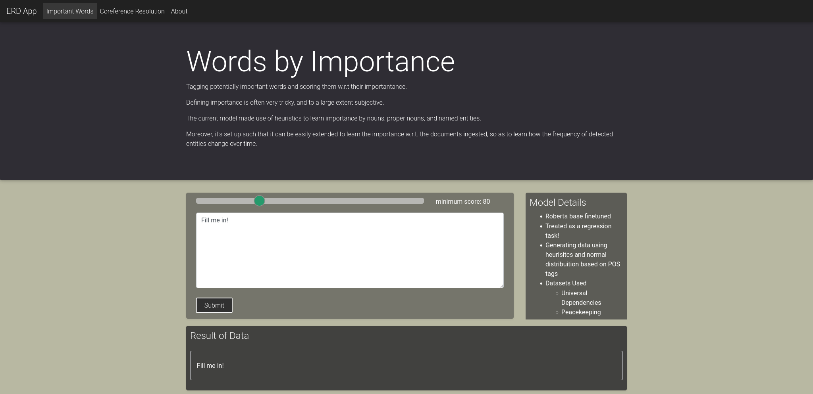
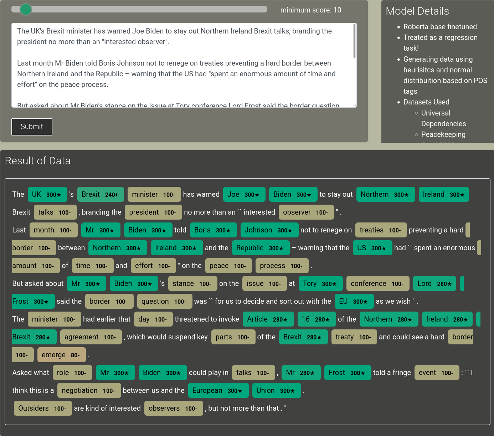
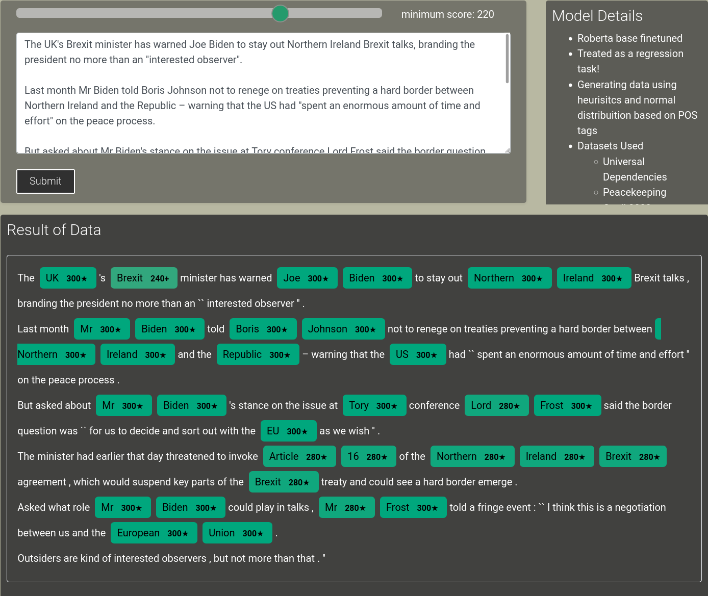

# Towards Semi Supervised Named Entity Recognition

## Overview

Named Entity Recognition can be very useful to perform downstream tasks like classification, increase efficiancy for search algorithms, build powerful content recommendation systems or browse through information quickly!

Despite so many use cases, most NER are very dependent on labelled data. This often restricts building these systems to domains of already existing datasets.

This project aims to build a system capable generating labels based on confidence scores to identify potential entities, and more importantly named entities. 

This flexibility, then allows us to further monitor, generate data and finetune to our domain specific use cases. 

**Note:** because what is important in each domain, or to each indivisual is unique depending on the task they are trying to solve, it's not wise to remove the domain dependent nature of this task. Hence, this project aims to generate these labels instead.

---

### About the model

It uses a pretrained Roberta, which is then finetuned on various NER datasets. Moreover, the finetuning is done in a way to capture the underlying distribution of the entities present and represent them on a scale between **0-300**.

#### Simple Flask app for visualization

I built a simple Flask app for visualization of system, and illustate it better. To run the app, please install the dependencies, and run app.py file.

```
pip install -r requirements.txt 
python app.py
```

Note: the **minimum score field** as the input, setting this field will help filter out entities with repsect their importance.

The idea is to finetune this model based on user preference/ task to denote the importance in a particular context.



## Minimum Score set to 10



## Minimum Score set to 220

